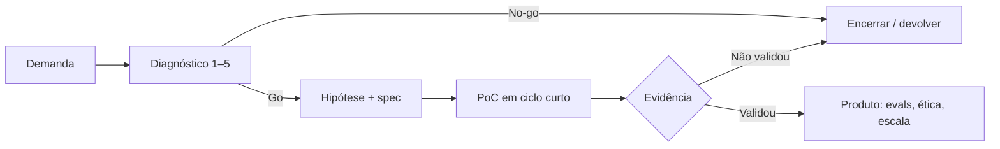

# Tatiana Florentino

**Lidero laboratórios e produtos de inteligência artificial no setor público — do diagnóstico do problema à escala da solução — com governança ética, redes de inovação e evidência de valor para o cidadão.**

Product Manager de IA Low Code · Gerência de Inovações Digitais · Governo de Goiás  
Associada à [Rede InovaGov](https://inovagov.enap.gov.br/) (ENAP/GNova) · Associada e líder da Rede TIC Goiás

[LinkedIn](https://www.linkedin.com/in/tatianaflorentino/) · [GitHub](https://github.com/TatianaFlorentino) · tatianafloren@gmail.com

  
  
  

---

## Linha de pesquisa

**Laboratórios de inovação pública e produtos de inteligência artificial responsável:** métodos de diagnóstico, experimentação e escala de soluções de IA (agentes, low-code e sistemas multiagentes) na gestão pública, com ênfase em ética, acessibilidade e evidência de valor.

### Três perguntas (agenda até 2027)

1. Como um laboratório de governo decide **o que** prototipar em IA — e o que matar — com diagnóstico, não com hype?
2. Como transformar PoCs de agentes e low-code em **produto observável** (evals, spec, humano no loop) no setor público?
3. Como redes (TIC, InovaGov) e laboratórios aceleram adoção responsável de IA sem perder controle ético, dados e acessibilidade?

### Método de diagnóstico — prontidão para IA

Rubrica 1–5 aplicada ao órgão **antes** de construir agente ou automação. Sem nota mínima nos eixos críticos, a iniciativa não entra no laboratório.

| Eixo | O que se observa | Go / No-go |
| --- | --- | --- |
| **Problema** | Dor pública delimitada, dono, cidadão ou servidor afetado | Sem problema nomeado → não prototipa |
| **Dados** | Origem, qualidade, LGPD, o que pode ir a modelo | Dado pessoal sem base legal → não prototipa |
| **Processo** | Fluxo atual, gargalo, o que a IA substitui ou apoia | Processo inexistente → diagnostica primeiro |
| **Pessoas** | Quem valida, quem opera, capacitação | Sem humano no loop em decisão crítica → não escala |
| **Ética e acesso** | Viés, transparência, linguagem simples, acessibilidade | Risco alto sem salvaguarda → mata ou redesenha |
| **Infra** | Onde roda (Gemini, Ollama, ADK, low-code), observabilidade | Sem eval / rastreio → fica em lab, não em produção |

---

## Lab OS — como o laboratório decide

O laboratório não é uma fila de ideias. É um **sistema de decisão**.

| Etapa | Pergunta que o lab faz | Resultado aceitável |
| --- | --- | --- |
| **Entrada** | Qual problema público? Quem sofre? | Ficha de diagnóstico preenchida |
| **Hipótese** | O que muda se a IA existir? | Spec: missão, fora de escopo, critérios de pronto |
| **Experimento** | Dá para testar em dias, com dado sintético ou recorte? | PoC observável, não demo de chat |
| **Decisão** | Escalar, pivotar ou matar? | Registro escrito — inclusive do que *não* segue |
| **Escala** | Tem dono, eval, humano no loop e acessibilidade? | Produto na operação, não no laboratório |

Kill criteria (o lab recusa): ferramenta em busca de problema · dado real de cidadão no GitHub · PoC sem critério de pronto · IA autônoma em decisão que exige responsabilidade humana.

---

## Três cases de produto

Sistema na capa. Stack no rodapé de cada case.

### 1. Auditoria de documentos com IA

**Problema.** Conferência documental lenta, inconsistente e cara de escalar com gente só.  
**Diagnóstico.** O gargalo não é “falta de LLM” — é ausência de critério de conferência, rastreio da decisão e validação com quem opera o processo.  
**Produto.** Solução ponta a ponta de auditoria/conferência com agentes (Google ADK, Gemini, AI Studio), do protótipo à validação com usuários — formação AI Product Leaders (Tera, Turma 4, 2026).  
**Ética.** Humano no loop em parecer crítico. Dados sintéticos em repositório público.  
**Status.** Case de produto · repositório público em abertura.

### 2. Agente cidadão

**Problema.** Cidadão e servidor se perdem em linguagem de órgão, filas e FAQ morto.  
**Diagnóstico.** Atendimento falha antes da tecnologia: jargão, falta de recorte do que o agente *não* pode responder, risco de dado pessoal.  
**Produto.** [`citizen_assistant`](https://github.com/TatianaFlorentino/citizen_assistant) — agente de IA com recorte de serviço público, linguagem simples e limite explícito de atuação.  
**Ética.** Acessibilidade e LGPD na spec, não no slide final.  
**Status.** Repositório ativo · README de produto em evolução.

### 3. Banco de soluções de IA para a gestão pública

**Problema.** Órgãos reinventam a mesma PoC; a inovação não circula pelo *problema*, só pela ferramenta.  
**Diagnóstico.** Falta catálogo comparável: dono, maturidade, risco ético, o que já foi tentado.  
**Produto.** Base nacional de soluções e ideias de IA no setor público, organizada **pelo problema que resolvem** — ministérios, prefeituras, universidades, ICTs. Ativo de inovação aberta (InovaGov).  
**Ética.** Ficha com risco, dado e supervisão humana.  
**Status.** Iniciativa em construção · 15 fichas de MVP como meta pública.

---

## Liderança de rede — o que a rede produziu

Não é logo. É produção. Catálogo público: [`rede-tic-acoes`](https://github.com/TatianaFlorentino/rede-tic-acoes).

### Rede TIC Goiás — liderança (desde dez/2025)

Comunidade de TIC do Governo de Goiás: unidade central (STI/SGG) e setoriais. Fonte interna: [SharePoint](https://goiasgovbr.sharepoint.com/sites/redetic) (mai/2026). Marco: [Decreto nº 10.730/2025](https://legisla.casacivil.go.gov.br/pesquisa_legislacao/111078/decreto-10730).

**Pleno funcionamento desde julho de 2026:** mais de **175 colaboradores** ativados, com GRG/FCRG redistribuída no Estado.

| Entrega | O que saiu do papel |
| --- | --- |
| **Estruturação mínima** | Arranjo para a Rede operar: canal, rito, gente e plano — sem depender de organograma que a gestão desfez |
| **Visitas às setoriais** | Ciclo presencial **abril–maio de 2026** (concluído) |
| **Indicações** | Formulário publicado, compilação e revisão jurídica versus o decreto |
| **Planos de trabalho** | Um plano para as setoriais e outro para a unidade central (art. 17), com workflow da chefia imediata |
| **Ativação e desativação** | Processo de entrada e saída de membros; normativo de critérios em fechamento |
| **GETIC** | Sistema de gestão da Rede — fluxo **desenhado por mim**: indicadores, parte contábil, planos, workflow, integração com o **SEI**, evidências num módulo **S3**. Cada membro vê o próprio plano, atividades e histórico; cada chefia vê só o time da Rede na sua unidade. Sai do controle manual |
| **Capacitação** | Plano feito e **direcionado ao laboratório da LIGO** — execução em andamento |

O desenho por eixos/embaixadores do plano de fevereiro foi desconstituído na troca de Subsecretaria. No lugar ficou a Rede que funciona: setorial + central, GETIC e gratificação atrelada a quem atua.

### Rede InovaGov

Associada (ENAP/GNova). Conexão nacional de inovação pública: práticas, comunidades, agenda de laboratórios e IA responsável.

Na prática: articular órgãos, disseminar o que funciona, impedir que cada secretaria recomece do zero. A rede é o canal de escala do laboratório.

---

## Fronteira — em construção

A formação vira artefato. Sem artefato, fica no rodapé.

| Frente | O que está sendo construído | Quando |
| --- | --- | --- |
| **Sistemas multiagentes** | `multiagentes-gov` — orquestração, MCP, LangGraph/CrewAI, evals e tracing num fluxo público pequeno e rodável | 2026 · em formação (Tera — AI Engineering para Sistemas Multiagentes) |
| **Spec-Driven Development** | Spec como fonte da verdade para agente (missão, stack, roadmap, critérios de pronto) aplicada a caso de governo — não material de curso | 2026 · em evolução ([spec-driven](https://github.com/TatianaFlorentino/sc-spec-driven-development-files)) |

Última atualização desta seção: **setembro de 2026**.

---

## Formações — prova de capacidade, não identidade

A capa é o laboratório. Isto é o que sustenta a execução.

**Em andamento (Tera, 2026)**  
AI Business Leader · AI Engineering para Sistemas Multiagentes

**Concluído**  
AI Product Leaders (Tera, Turma 4, 2026) — projeto: auditoria documental com IA  
AI Product Builders (Tera) — n8n, Zapier, Lovable, agentes  
Certificação em Transformação e Inovação da Gestão e dos Serviços Públicos  
MBA Data Science e Analytics — USP (2020–2022)  
Liderança em Inteligência Artificial — DataCamp  
Product Management — PM3 (2020)

Trajetória de produto e dados (síntese): Stone, Via Varejo, Webmotors, TecBan, Sem Parar — discovery, analytics e plataformas. No setor público: Gerência de Inovações Digitais, Laboratório de Soluções de IA, liderança da Rede TIC Goiás (GETIC, ativação da Rede, LIGO), Campus Party Goiás 2025 (palestra: low-code, IA e automação).
